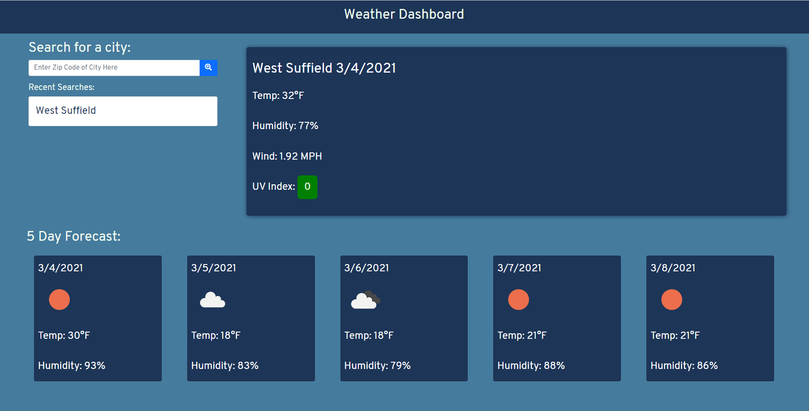

# Weather Dashboard

This application allows user to search for cities with the location's zipcode and receieve information about the current weather, along with the five day forecast. The search will be saved to local storage and can easily be returned to.

The Deployed Application can be accessed at : [Weather-Dashboard](https://aseppala98.github.io/Weather-Dashboard/)

# Technologies Used:
-HTML
-CSS
-Bootstrap v5.0.0
-javaScript

